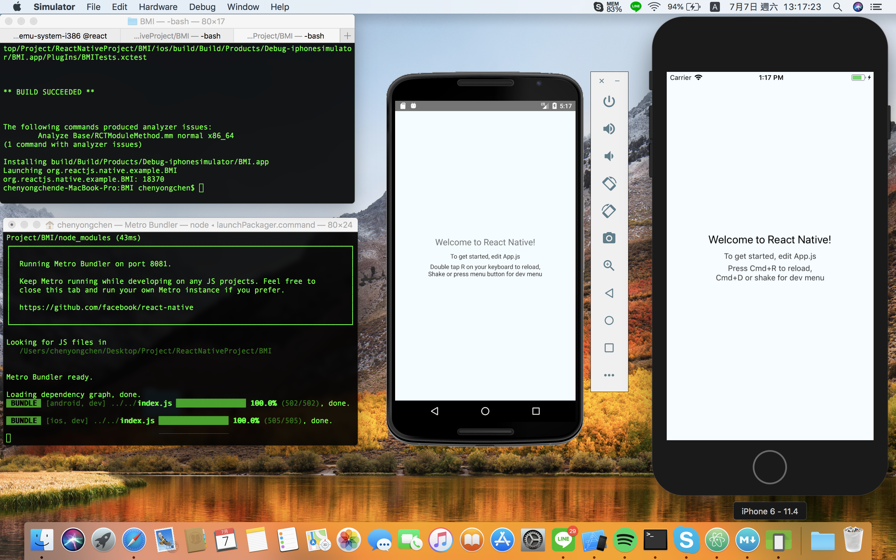
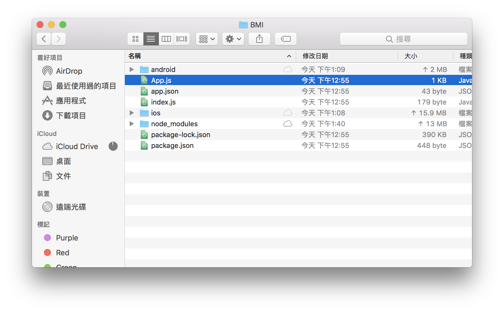

## React Native 教學

### 入門教學

React Native 的中文教學實在太少，這邊先教大家最基礎的，架設環境的部分之後會在慢慢補上

先從最經典的 BMI 開始吧！

### BMI

先建立一個資料夾好管理之後的專案

```
> mkdir ReactNativeProject
> cd ReactNativeProject/
```
建立你的專案名稱 (這裡我就叫BMI，可以自己改)

```
> react-native init BMI
```
跑的途中來開啟虛擬機吧

### 開啟虛擬機

#### Android

```
> emulator @react 
```

#### iOS

```
都用 MAC 了還要我教啊 (不會後面還有救)
```

### 開啟你的 APP 吧

先進到你的BMI專案裡

```
> cd BMI/
```

#### Android  
    react-native run-android
    
#### IOS
    react-native run-ios (mac會自動幫你開啟虛擬機 不怕不怕 沒有開啟的話就在打一次

成功之後大家應該會看到這樣



成功之後就來看程式碼吧

###程式碼

開啟目錄下的 App.js




