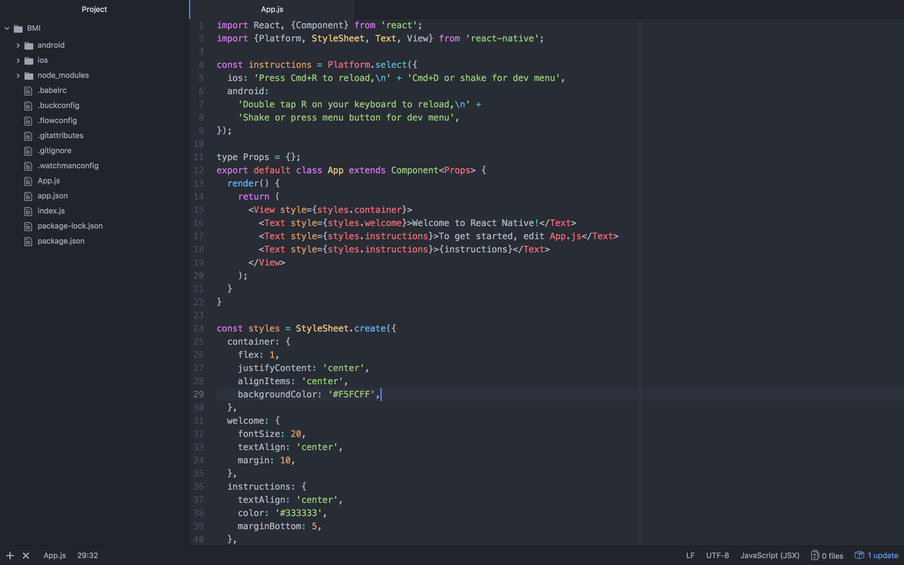
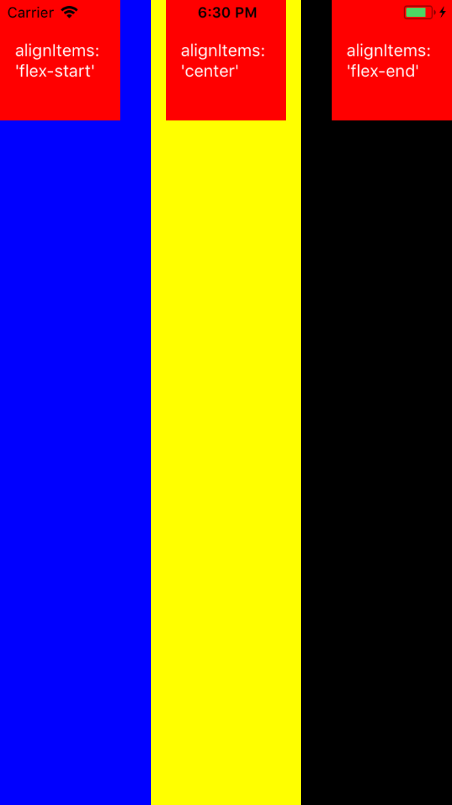

## React Native 教學

### 入門教學

React Native 的中文教學實在太少，這邊先教大家最基礎的，架設環境的部分之後會在慢慢補上

如果喜歡我的教學可以給我一顆 Star 讓我有動力繼續寫下去到進階。

先從最經典的 BMI 開始吧！

### BMI

先建立一個資料夾好管理之後的專案

```
> mkdir ReactNativeProject
> cd ReactNativeProject/
```
建立你的專案名稱 (這裡我就叫BMI，可以自己改)

```
> react-native init BMI
```
跑的途中來開啟虛擬機吧

### 開啟虛擬機

#### Android

```
> emulator @react 
```

#### iOS

```
都用 MAC 了還要我教啊 (不會後面還有救)
```

### 開啟你的 APP 吧

先進到你的BMI專案裡

```
> cd BMI/
```

#### Android  
    react-native run-android
    
#### IOS
    react-native run-ios (mac會自動幫你開啟虛擬機 不怕不怕 沒有開啟的話就在打一次

成功之後大家應該會看到這樣


成功之後就來看程式碼吧

### 程式碼

開啟目錄下的 App.js




ReactNative 也有生命週期，如果有興趣可以去 google 查一下

其中 render() 是他的進入點，裡面是它呈現在畫面上的元件 

要用什麼元件就 import 什麼進來

因為我們要做 BMI 所以需要 兩個輸入匡 和 一個按鈕

我們當然可以直接改成這樣

``` javascript
import React, {Component} from 'react';
import {Platform, StyleSheet, Text, View, TextInput, Button} from 'react-native';

type Props = {};
export default class App extends Component<Props> {
  render() {
    return (
      <View style={styles.container}>
        <TextInput placeholder = '身高'/>
        <TextInput placeholder = '體重'/>

        <Button title='計算' />
      </View>
    );
  }
}

const styles = StyleSheet.create({
  container: {
    flex: 1,
    justifyContent: 'center',
    alignItems: 'center',
    backgroundColor: '#F5FCFF',
  },
});

```


但這樣會有個問題，目前只有一個 View 所以寫起來沒有什麼障礙

不過隨便看個Facebook 光下面那排就有六個 View 了 

不管是開發的途中或是以後要維護都很麻煩

所以我們把它分類一下吧

我們在目錄底下建一個資料夾叫 Router 裡面再一個 Views

再來再建一個檔 BMI.js  像底下這樣


把我寫好的基本頁面檔 [page.js](https://github.com/zz129869523/ReactNative/blob/master/page.js) 程式碼貼到上面來


把 App.js 改成這樣

``` javascript
// App.js
import React, {Component} from 'react';
import {Platform, StyleSheet, Text, View, TextInput, Button} from 'react-native';

import BMI from './Router/Views/BMI'

type Props = {};
export default class App extends Component<Props> {
  render() {
    return (
      <BMI />
    );
  }
}

const styles = StyleSheet.create({
  container: {
    flex: 1,
    justifyContent: 'center',
    alignItems: 'center',
    backgroundColor: '#F5FCFF',
  },
});

```

### 重新載入

#### Android

```
按兩下 Ｒ 
或者 command + M 的 reload
```
#### iOS
```
command + R
```

 

成功之後我們去 BMI.js 建 View 吧

進來先把 App 改成 BMI 不影響程式 可是我們比較好認

``` javascript
export default class BMI extends Component 
```

TextInput 有很多屬性可以用 可以去官網看 [TextInput](https://facebook.github.io/react-native/docs/textinput.html)

常用的像是

- placeholder 
- value 					直接給值好像很沒有用 哈哈
- onChangeText			改變值的時候會馬上傳給你 Type function
- keyboardType			鍵盤類型
- onFoucs					點到她的時候觸發function Type function
- secureTextEntry		變＊＊＊

來試看看吧

修改一下 BMI.js 

``` javascript
// BMI.js

import React, { Component } from 'react';
import {
  StyleSheet,
  Text,
  View,
  TextInput,
} from 'react-native';

export default class BMI extends Component {

  constructor(props) {
    super(props);
      this.state = {
        text: 'I am value'
      }
  }
  static defaultProps = {

  }

  _onChangeText(value) {

    this.setState({text: value})

  }
  render() {
    return (
      <View style={styles.container}>
        <TextInput
          placeholder = "體重"
          value = "123456"
          onChangeText = {(value) => this._onChangeText(value)}
        />
        <Text>{this.state.text}</Text>
      </View>
    );
  }
}

const styles = StyleSheet.create({
  container: {
    flex: 1,
    justifyContent: 'center',
    alignItems: 'center',
    backgroundColor: '#F5FCFF',
  },
});
```


state 是 ReactNative 拿來儲存變數資料用的

所以一開始值是 123456 而 this.state.text是 'I am value'

setState() 可以宣告值，修改值也可以

當改動時 會叫到函數 _onChangeText()

因為onchangeText是即時的 所以上面的text會馬上更改

### Components

不過現在又有個問題了 只是一個輸入匡就這麼大 之後看的人會很辛苦 所以我們把它寫一個專屬的元件吧

我們在 Router 底下再建一個資料夾 Components 個人習慣所以叫做UITextView.js

一樣 [page.js](https://github.com/zz129869523/ReactNative/blob/master/page.js) 貼上


改成專門處理 UITextView 的元件

```javascript 
// UITextView.js

import React, { Component } from 'react';
import {
  StyleSheet,
  Text,
  View,
  TextInput,
} from 'react-native';

export default class UITextView extends Component {

  constructor(props) {
    super(props);
      this.state = {

      }
  }
  static defaultProps = {

  }
  render() {
    return (
      <View>
        <TextInput
          placeholder = "體重"
          keyboardType = 'numeric'
        />

      </View>
    );
  }
}

const styles = StyleSheet.create({

});
```
BMI.js 也一起改

```javascript 
import React, { Component } from 'react';
import {
  StyleSheet,
  Text,
  View,
} from 'react-native';
import UITextView from '../Components/UITextView'
export default class BMI extends Component {

  constructor(props) {
    super(props);
      this.state = {
      }
  }
  static defaultProps = {

  }

  render() {
    return (
      <View style={styles.container}>
        <UITextView />
      </View>
    );
  }
}

const styles = StyleSheet.create({
  container: {
    flex: 1,
    justifyContent: 'center',
    alignItems: 'center',
    backgroundColor: '#F5FCFF',
  },
});
```
跑看看


### 排版 And 樣式

用這麼久終於到很重要的排版與樣式了 

React Native 佈局方式是 FlexBox

### 排版

學這麼久一定對下面 styles 的
``` html 
justifyContent: 'center',
 alignItems: 'center',
```
很有疑問吧

為了學會排版 我寫了一個 View

### justifyContent


``` html
<View style={{flex: 1,justifyContent: 'flex-start',backgroundColor: '#F5FCFF',}}>
	<View style={{width: 200,height: 100,justifyContent: 'center',alignItems: 'center',backgroundColor: 'red'}}>
   		<Text style = {{color: 'white',}}>justifyContent: 'flex-start'</Text>
    </View>
</View>
```

 

justifyContent 是負責 `垂直` 的 

方式就是管理在自己範圍內的所以元件都必須遵守

第一個 View 規定裡面的 View 必須在 flex-start 的位置上

第二個 View 規定裡面的 Text 必須 在正中間

justifyContent enum('flex-start', 'flex-end', 'center', 'space-between', 'space-around')

來試試其他的

 

### alignItems

alignItems 是負責 `水平` 的 

alignItems enum('flex-start', 'flex-end', 'center', 'stretch')


 
 

如果你一次三個的話他會變成這樣

``` html
<View style={{flex: 1, }}>
	<View style={{flex: 1,alignItems: 'flex-start',backgroundColor: '#F5FCFF',}}>
		<View style={{width: 100,height: 100,justifyContent: 'center',alignItems: 'center',backgroundColor: 'red'}}>
    		<Text style = {{color: 'white',}}>alignItems: 'flex-start'</Text>
  		</View>
	</View>
	<View style={{flex: 1,alignItems: 'center',backgroundColor: '#F5FCFF',}}>
  		<View style={{width: 100,height: 100,justifyContent: 'center',alignItems: 'center',backgroundColor: 'red'}}>
      		<Text style = {{color: 'white',}}>alignItems: 'center'</Text>
	  	</View>
	</View>
	<View style={{flex: 1,alignItems: 'flex-end',backgroundColor: '#F5FCFF',}}>
	  	<View style={{width: 100,height: 100,justifyContent: 'center',alignItems: 'center',backgroundColor: 'red'}}>
	    	<Text style = {{color: 'white',}}>alignItems: 'flex-end'</Text>
	  	</View>
	</View>
</View>
```

 

因為 React Native 預設值的排列方式垂直的

上個顏色比較好懂


外面的 View style 加上{{flexDirection:'row',}} 就行了




所以兩個一起來當然可以囉


### flex

用 flex 來分配整個畫面的比例 

``` html
<View style={{flex: 1, }}>

	<View style={{flex: 1,justifyContent: 'center',alignItems: 'center',backgroundColor: 'skyblue',}}>
		<View style={{width: 200,height: 100,justifyContent: 'center',alignItems: 'center',backgroundColor: 'red'}}>
     			<Text style = {{color: 'white',}}>flex: 1</Text>
		</View>
	</View>

  	<View style={{flex: 1,justifyContent: 'center',alignItems: 'center',backgroundColor: 'yellow',}}>
    		<View style={{width: 200,height: 100,justifyContent: 'center',alignItems: 'center',backgroundColor: 'red'}}>
    			<Text style = {{color: 'white',}}>flex: 1</Text>
     		</View>
  	</View>
  	
</View>
```


